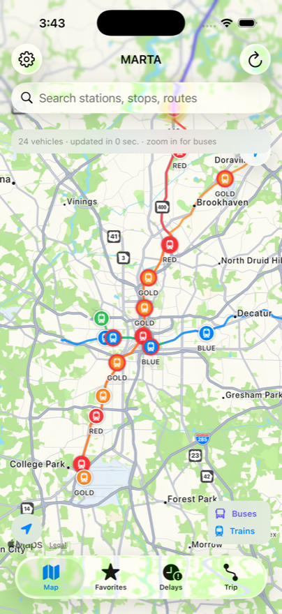
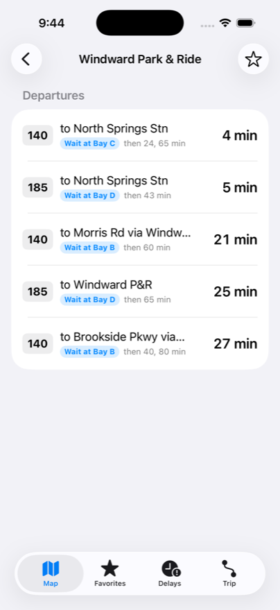
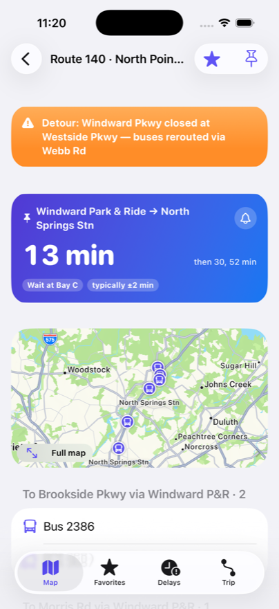
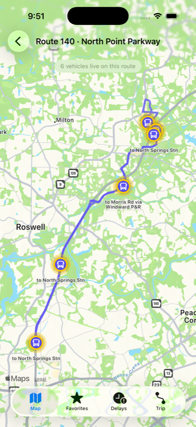

# MARTA Tracker

Personal-use app for real-time MARTA bus/train locations, ETAs, and delay
status, backed by a Python service that accumulates historical arrival/delay
data to eventually power lateness predictions.

Not affiliated with MARTA — uses the public data only, no branding.

## Screenshots

| Live system map | Departures with bay guidance |
|---|---|
|  |  |

| Commute card, alerts & confidence | Single-route live map |
|---|---|
|  |  |

## Status

| Phase | What | State |
|-------|------|-------|
| A | Python data-collector service | ✅ complete, running |
| iOS 1 | SwiftUI live map + arrivals | ✅ complete, runs in simulator |
| iOS 2 | Favorites & polish | ✅ complete, runs in simulator |
| iOS 3 | Historical stats (via Python service) | ✅ complete; ML deferred until more data |
| iOS 4 | Trip planning (OTP + delay-aware) | ✅ complete, runs in simulator |

## Repository layout

```
collector/            Python data-collection service (Phase A)
ios/MartaTracker/      SwiftUI iOS app (Phase 1)
data/                 SQLite DB + GTFS static feed (gitignored)
.env                  MARTA rail API key (gitignored, you create it)
```

## Python collector

Polls both MARTA feeds every 45s, normalizes them into one schema, and writes
every change to SQLite — the historical dataset predictions will train on. A
FastAPI service exposes the collected data.

**Setup:**
```sh
python3 -m venv venv
./venv/bin/pip install gtfs-realtime-bindings requests fastapi "uvicorn[standard]" python-dotenv
```

**Run the collector** (loads the GTFS static schedule on first start, then polls):
```sh
./venv/bin/python -m collector.collector
```

**Run the query API:**
```sh
./venv/bin/python -m collector.api      # http://127.0.0.1:8000
```
Endpoints:
- `/health` — row counts + feed freshness
- `/positions` — latest position per vehicle/train
- `/arrivals` — recent observations, filterable by stop/route/source
- `/stats/delay` — per-group delay stats (median, p90, on-time/late/early %),
  grouped by `route`, `stop`, `hour`, or `route_hour`. The Phase 3 groundwork.

**Run the tests:**
```sh
./venv/bin/pip install pytest
./venv/bin/pytest tests/
```
Covers delay parsing, the Eastern-time/service-day schedule math, NULL-aware
dedup, plausibility clamping, bus/rail normalization, and the stats helpers.

**How delay is computed:**
- Rail — provided directly by the REST feed (`T93S` = 93s late).
- Bus — the RT feed omits delay, so it's computed as
  `predicted_time − scheduled_time`, with the scheduled time joined from GTFS
  static `stop_times.txt` on `trip_id + stop_id` (a clean join — verified
  369/369 trips). Implausible delays (>1h) are treated as feed noise.

Storage dedups: a new row is only written when a vehicle's delay at a stop
actually changes, keeping the historical dataset compact.

## iOS app

See [ios/README.md](ios/README.md). Four tabs: live **Map**, **Favorites**,
historical **Delays** (via the Python service), and multimodal **Trip** planning.
Phases 1–2 talk directly to MARTA's feeds; Phases 3–4 use the Python service.
Requires full Xcode.

## Trip planning (OpenTripPlanner)

See [otp/README.md](otp/README.md). Upstream OTP2 with MARTA's GTFS + Atlanta OSM
provides multimodal routing. The app's Trip tab calls the Python service's
`/plan`, which proxies OTP and annotates each transit leg with our historical
delay stats — routing that knows which buses/trains typically run late.

## Secrets

The MARTA rail API key lives in `.env` (`MARTA_RAIL_API_KEY=...`), gitignored.
The iOS app reads it at build time from `ios/.../Config/Secrets.xcconfig`
(also gitignored). Never hardcoded in source.
```sh
# .env (project root) — you create this
MARTA_RAIL_API_KEY=your_key_here
```
